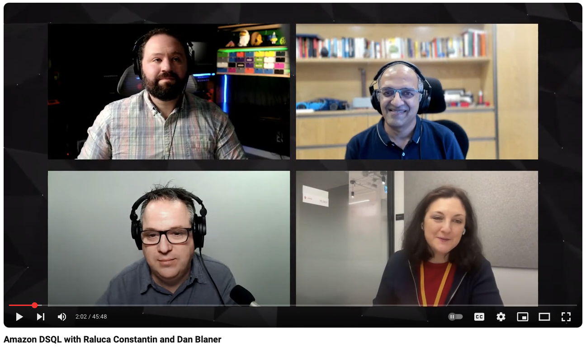

# Rust Aurora DSQL Demo with Authentication Tokens

> This project was created during a livestream featuring Darko Mesaros and Stephen Barr.
> Watch the full session: [Building a Rust application with Aurora PostgreSQL Data API | AWS Livestream](https://www.youtube.com/watch?v=p2-V01XBHNg)


> For a deep dive into Amazon DSQL with Raluca Constantin and Dan Blaner, check out:
> [Amazon DSQL: A relational database specifically designed for modern applications | AWS Events](https://www.youtube.com/watch?v=WuNlALS1wrM)



A Rust application that demonstrates how to connect to an Amazon Aurora DSQL database using SQLx, including IAM authentication token generation.

## Prerequisites

- Rust and Cargo (https://www.rust-lang.org/tools/install)
- AWS credentials configured in your environment (~/.aws/credentials or environment variables)
- PostgreSQL client for local testing (psql)
- `libpq` development files (required by sqlx-postgres)
  - For Ubuntu/Debian: `sudo apt install libpq-dev`
  - For macOS: `brew install postgresql`

## Setup

1. Clone this repository
2. Update the `.env` file with your PostgreSQL credentials:

```
DB_HOST=your_cluster_endpoint.dsql.region.on.aws
DB_PORT=5432
DB_USER=admin
DB_NAME=postgres
```

Note: You no longer need to set DB_PASSWORD in the .env file, as this application now generates authentication tokens for connecting to Aurora DSQL.

## Authentication Mechanism

The application uses AWS IAM authentication for Aurora DSQL, implemented in the `auth.rs` module. This approach eliminates the need for hardcoded database passwords and instead uses short-lived tokens generated through AWS credentials.

Key features of the authentication mechanism:

- **Token Generation**: The `generate_auth_token` function creates a signed token using the AWS DSQL SDK for Rust
- **Automatic Expiry**: Tokens are valid for 15 minutes, providing enhanced security
- **Role-Based Access**: Supports both admin and regular user authentication profiles
- **URL Encoding**: Handles special characters in tokens to ensure compatibility with connection strings
- **Region Support**: Configurable AWS region for multi-region deployments

This approach is more secure than traditional password authentication since it leverages AWS IAM policies and temporary credentials.

## Running the Application

```bash
# List available commands
cargo run -- help

# Generate an authentication token for Aurora DSQL
cargo run -- generate-token

# Generate a token with custom parameters
cargo run -- generate-token --region us-east-1 --endpoint your-cluster.dsql.us-east-1.on.aws

# Generate a token for a non-admin user
cargo run -- generate-token --admin false

# Just output the token without extra information
cargo run -- generate-token --token-only
```

## Database Operations

```bash
# List users in the database
cargo run -- list-users

# Add a new user interactively
cargo run -- add-user

# Repopulate the database (WARNING: drops existing users table)
cargo run -- repopulate

# Get detailed user statistics from the database
cargo run -- user-stats

# Run a stress test with default parameters (100 users, 10 concurrent threads)
cargo run -- stress-test

# Run a customized stress test
cargo run -- stress-test --users 500 --concurrency 20
```

## Stress Testing

The application includes a robust stress testing capability that allows you to:

- Test the database with a configurable number of concurrent connections
- Insert a specified number of users with unique, randomly generated data
- Batch operations for optimal performance
- Measure key performance metrics like throughput and success rates

Example stress test output:
```
Total time: 27.32 seconds
Successful inserts: 500
Failed inserts: 0
Insert rate: 18.30 users/second
```

## User Statistics

The user-stats command provides comprehensive analytics about the database contents:

- Total user count and distribution by role
- Newest and oldest user details
- Creation time distribution by hour of day (with visual representation)
- Name length statistics (longest, shortest, average)
- Most common first names and email domains
- User creation trends by date

## Features

- Connects to Aurora DSQL using SQLx
- Generates IAM authentication tokens for secure connections
- Supports both admin and regular user authentication
- Loads database credentials from a `.env` file
- Performs basic database operations (create tables, insert, query)
- Provides comprehensive stress testing capabilities
- Offers detailed statistical analysis of database content
- Uses TIMESTAMPTZ for proper timezone support
- Implements UUID-based primary keys for reliable distributed ID generation

## Dependencies

- `sqlx` - Async SQL library with compile-time checked queries
- `aws-config` and `aws-sdk-dsql` - AWS SDK for Rust with Aurora DSQL support
- `dotenv` - For loading environment variables from a `.env` file
- `tokio` - Async runtime for Rust
- `clap` - Command line argument parsing
- `percent-encoding` - URL encoding of authentication tokens
- `dialoguer` - Interactive CLI utilities 